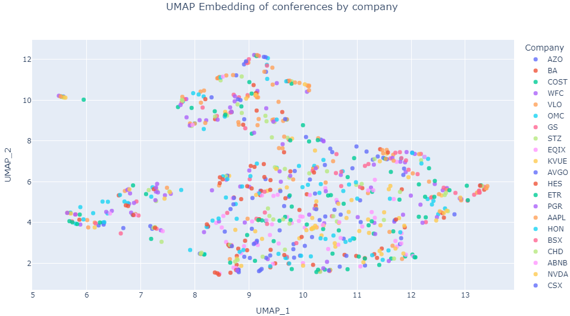

# Multimodal AI in Finance

This project implements a pipeline to analyze financial conferences by combining text, audio, and video processing. The main code is located in `src/multimodal_fin` and is organized into several modules.

## Main Components

### Preprocessor
- Location: `src/multimodal_fin/processors/Preprocessor.py`
- Splits the transcript into "prepared remarks" and "q_a" sections.
- Classifies each intervention using an ensemble of models (`EnsembleInterventionClassifier`).
- Annotates question–answer pairs.
- Saves the result as a CSV file.

### MultimodalProcessor
- Location: `src/multimodal_fin/processors/MultiModalProcessor.py`
- Extracts audio, text, and video embeddings through `EmbeddingsExtractor`.
- Enriches these embeddings with information obtained from LLMs via `MetadataEnricher` (topic classification, QA analysis, coherence).
- Generates a JSON file with all metadata.

### ConferenceProcessor
- Location: `src/multimodal_fin/processors/conference.py`
- Orchestrates the full pipeline for each conference: preprocessing, embedding extraction, and enrichment.
- Reads the paths from a CSV and saves the processed results in a `processed` folder.

### Emotions Detection
- Location: `src/multimodal_fin/emotions`
- Aims to extract emotional embeddings from the 3 channels for each sentence in relevant interventions.

### Embeddings Pipeline
- Location: `src/multimodal_fin/embeddings`
- Enables the creation of vector representations from the enriched JSON. Includes node-level and conference-level models (`NodeEncoder` and `ConferenceEncoder`).

### CLI
- Location: `src/multimodal_fin/cli.py`
- Exposes two commands using [Typer](https://typer.tiangolo.com/):
  - `download`: downloads the necessary data from Earningscall API and organizes ir into the appropiate format. 
  - `process`: runs the full pipeline (textual and multimodal) based on a YAML configuration file.
  - `embed`: generates embeddings from a previously enriched JSON.

## Configuration
The file `config/config.yaml` contains an example configuration. Each section under `conferences_processing` defines:
- Input paths (`input_csv_path`).
- Lists of models for different tasks (QA, monologue, sec10k, etc.).
- Configuration parameters for the two transformers used for embedding extraction.

It can also include an `embeddings_pipeline` block for encoder parameters when using the embedding generation commands.

## How to Use the System

1. **Installation**: Run from the project root directory:
   ```bash
   cd 2025_ACA_MultichannelAI/
   pip install -e .
   ```

2. **Download SP500 Conference Data**: This will download a subset of earnings call data (transcripts and audio) for companies in the S&P 500 and store them under   the folder specified in your config.
   ```bash
   multimodal-fin download --config-file config/config.yaml
   ```

3. **Prepare the Conferences**: Create a CSV with the path to each conference (similar to `data/paths.csv`). Each folder must contain `transcript.csv` (derived from `LEVEL_3.json`, which contains interventions one by one with timestamps), `LEVEL_4.json` (which marks the separation between introduction and Q&A session), and the multimedia files.

4. **Run the Pipeline**: This includes textual classification, multimodal analysis, and generation of the enriched JSON.
   ```bash
   multimodal-fin process --config-file config/config.yaml --config-name default
   ```
   This will produce a CSV and an enriched JSON inside a `processed` folder next to each conference.

5. **Generate Embeddings**: For this step, pretrained weights of the proposed architecture are required. See `notebooks/train_encoders.ipynb`.
   
   For a single file:
   ```bash
   multimodal-fin embed   --config-file config/config.yaml   --config-name default  --json-path /ruta/a/transcript.json
   ```

   For multiple files, create a CSV with a single column called `Paths` containing the paths to each `transcript.json`:
   ```bash
   multimodal-fin embed   --config-file config/config.yaml   --config-name default  --json-csv data/json_paths.csv
   ```

## Expected Results
At the end, you will obtain:
- A CSV with classified and annotated interventions.
- A JSON containing multimodal embeddings and metadata (topic classification, coherence analysis, etc.).
- If the embeddings pipeline is used, vectors representing the entire conference for machine learning tasks.


