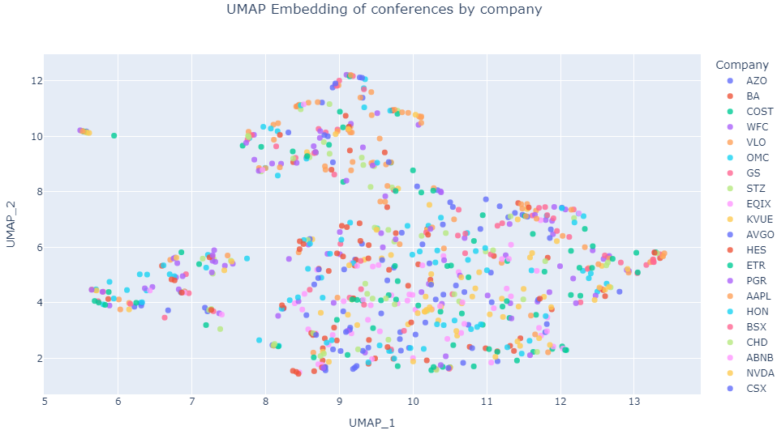

# Multimodal AI for Earnings Call Analysis

This repository implements a multimodal pipeline for the analysis of corporate earnings calls. The system processes transcripts and audio recordings, structures the Q&A section into analyst questions and managerial responses, extracts textual, acoustic, semantic, emotional, and interaction-level features, and generates enriched representations for downstream analysis.

The project is focused on earnings call communication, with particular attention to managerial responses in Q&A sessions. The pipeline supports the construction of interaction-level datasets, the detection of evasive or non-direct responses, the aggregation of communication signals at the conference level, and their later use in financial or market-reaction analyses.

The main code is located in `src/multimodal_fin`. The repository also includes configuration files, notebooks, trained weights, intermediate data folders, and result outputs used throughout the experimental workflow.

## Repository Structure

```text
config/                 Configuration files
data/                   Input paths and data references
notebooks/              Training, analysis, and experiment notebooks
results/                Experimental outputs, tables, and figures
src/multimodal_fin/     Main Python package
weights/                Model weights and trained components
static/                 Static images used in the README
```

## Main Functionalities

The repository supports the following stages:

* downloading and preparing earnings call transcripts and audio recordings;
* extracting and structuring Q&A interactions;
* generating textual, acoustic, emotional, semantic, and discourse-level features;
* producing enriched JSON files with metadata and multimodal representations;
* generating node-level and conference-level embeddings;
* building interaction-level datasets for managerial response analysis;
* aggregating interaction-level predictions into conference-level indicators;
* supporting downstream analyses involving market outcomes such as abnormal returns and abnormal volatility.

Although the broader framework was designed with multimodal extensibility in mind, the experiments currently supported by this repository focus on textual, acoustic, and interaction-level features. Video-related components are not part of the main empirical workflow.

## Installation

From the project root directory, create and activate a virtual environment if desired. Then install the project with Poetry:

```bash
cd 2025_ACA_MultichannelAI/
pip install poetry
poetry install
```

## Download Earnings Call Data

The following command downloads a subset of earnings call data, including transcripts and audio recordings, and stores them under the folder specified in the configuration file:

```bash
poetry run multimodal-fin download config/config.yaml
```

## Prepare the Conferences

Create a CSV file with the path to each conference, similar to `data/paths.csv`.

Each conference folder should contain:

* `transcript.csv`, derived from `LEVEL_3.json`, with speaker interventions and timestamps;
* `LEVEL_4.json`, identifying the separation between prepared remarks and the Q&A section;
* the corresponding audio recordings and metadata files.

## Run the Processing Pipeline

The processing pipeline performs intervention classification, Q&A construction, multimodal feature extraction, metadata generation, and enriched JSON creation.

```bash
poetry run multimodal-fin process config/config.yaml --config-name default
```

This produces, for each processed conference:

* a CSV file with classified and annotated interventions;
* structured Q&A pairs;
* an enriched JSON file containing multimodal features, metadata, topic labels, coherence information, and response-type annotations.

## Generate Conference Embeddings

The repository also supports the generation of structured conference-level embeddings. This step requires pretrained weights of the proposed architecture. See:

```text
notebooks/train_encoders.ipynb
```

For a single enriched JSON file:

```bash
poetry run multimodal-fin embed config/config.yaml --config-name default --json-path /path/to/transcript.json
```

For multiple files, create a CSV with a single column called `Paths`, containing the paths to each enriched JSON file:

```bash
poetry run multimodal-fin embed config/config.yaml --config-name default --json-csv data/json_paths.csv
```

## Interaction-Level and Conference-Level Analysis

The processed Q&A interactions can be used to construct datasets for managerial response analysis. In particular, the pipeline supports feature configurations based on textual, acoustic, emotional, structural, semantic, and multimodal descriptors.

Interaction-level predictions can be aggregated at the conference level to obtain indicators such as:

* `true_evasive_rate`;
* `predicted_evasive_rate`;
* `evasion_score_mean`.

These conference-level indicators can then be combined with external financial data to study market-related outcomes such as:

* cumulative abnormal returns, `CAR`;
* absolute cumulative abnormal returns, `|CAR|`;
* abnormal-return volatility, `AR_vol`.

Additional analyses can be performed by sector, year, or alternative event windows depending on the available market data and experimental setup.

## Expected Outputs

At the end of the pipeline, the repository can generate:

* classified and annotated earnings call interventions;
* structured analyst-manager Q&A pairs;
* enriched JSON files with multimodal features and metadata;
* Conference-level embeddings;
* interaction-level response predictions;
* conference-level communication indicators;
* tables and figures for downstream financial analysis.

## Embedding Visualization

The following figure illustrates an example projection of learned conference-level embeddings.


